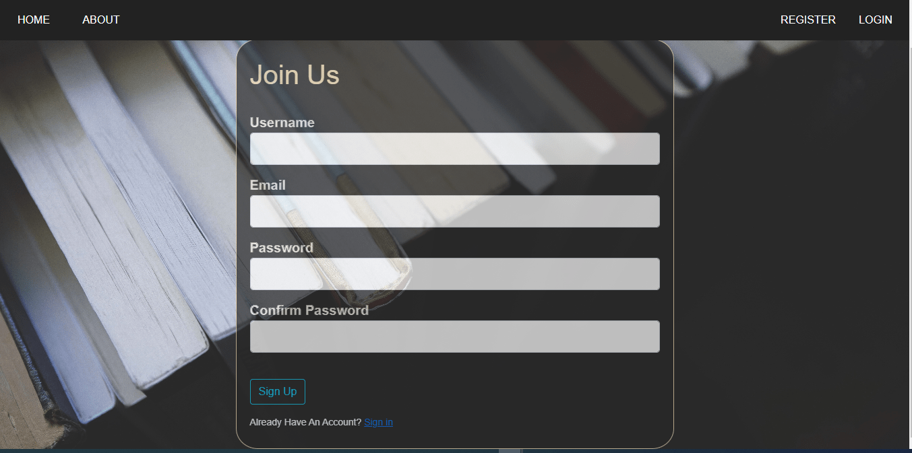
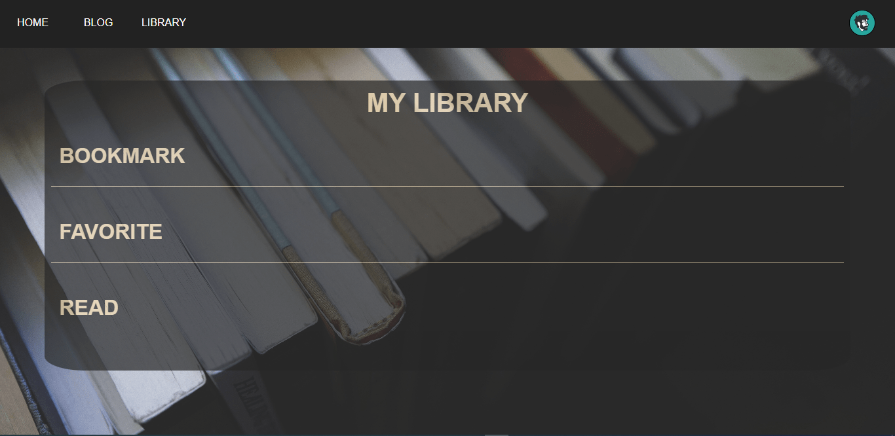

<!-- ⚠️ This README has been generated from the file(s) "blueprint.md" ⚠️--><!-- ⚠️ This README has been generated from the file(s) "blueprint.md" ⚠️--><p align="center">
  


<h1 align="center">ReBook</h1>
<h3 align="center">Get the Book you always wanted</h3>


</p>

<p align="center">
  <b>ReBook is a book recommendation website made with Python Flask. Our goal is to help everyone discover and explore new books in a fun and easy-to-use way. 
</b></br>
  <sub> ReBook makes personalized book recommendations for each user based on the user's profile and personal preferences. Users can search for books by author, genre or title, or simply browse our library of recommended titles. The site also allows users to post about their favorite book or the book they are reading while the can also follow a specific user post by following as and more. </sub><br>
  <sub>
  We hope ReBook helps you find new books to love! Enjoy exploring our library of books and let us know what you think. Happy reading! 
</sub>
</p>

<div align="center">

**[PROJECT PHILOSOPHY](https://github.com/bisryy/ReBook#-project-philosophy) • 
[INSPIRATION](https://github.com/bisryy/ReBook#-project-idea-inspiration) • 
[TECH STACK](https://github.com/bisryy/ReBook#-teck-stack) • 
[DEMO](https://github.com/bisryy/ReBook#--demo-project-links) • 
[SETUP](https://github.com/bisryy/ReBook#--run-the-application-locally) • 
[LICENSE](https://github.com/bisryy/ReBook#license)**

</div>

[](#--project-idea-inspiration)

## ➤ ➤ 💡 Project Idea Inspiration
> As avid readers and lifelong learners, we were constantly on the lookout for new and exciting books to add to our reading lists. However, we found it challenging to discover new titles beyond the bestseller lists and popular recommendations. That's when we had the idea to create a community where readers could share their favorite books and discover new ones through personalized recommendations.


[](#--project-philosophy)

## ➤  🧐 Project philosophy

> ReBook is a webapp that connects readers from all over the world and allows them to share their reading interests and experiences. 
> 
> By joining our community, you can discover new books through recommendations from like-minded readers, keep track of the books you've read and want to read, and even write reviews to help others in their reading journey.
**Read more about ReBook on [the project homepage](https://bisry.me/ReBook/#service-s).**


[](#--tech-stack)

## ➤ 👨‍💻 Tech stack

Here's a brief high-level overview of the tech stack ReBook uses:

- This project uses the [Flask web app development framework](https://flask.palletsprojects.com/). Flask is a micro web framework written in Python.

- For persistent storage (database), the app uses the [SQLAlchemy](https://hivedb.dev/), an open-source SQL toolkit and object-relational mapper for the Python programming language.

- The [ReBook Homepage](https://bisry.me/ReBook/)  is made by [React](https://react.org) and [ThreeJS](https://threejs.org), a cross-browser JavaScript library and application programming interface used to create and display animated 3D computer graphics in a web browser using WebGL.

- The website uses the font ["Ailerons"](https://befonts.com/ailerons-typeface.html) as its main font, and the design of the app adheres to design guidelines.

[](#--demo-project-links)

## ➤  🖥 DEMO Project Links
- [ReBook App](http://rebook.duresa.tech:5000/)
- [App Github](https://github.com/BisRyy/ReBook)
- [Website Live](https://read-book-rosy.vercel.app)
- [Website GitHub](https://github.com/BisRyy/ReBook-Landing-Page)


[](#--run-the-application-locally)

## ➤ 💻 Run the Application locally

### Install Requirements
```bash
./script.sh
```

### Start the Application
>In order to run the app your have create a google account and generate application password.
>It is used to send verification email to users.
>>Otherwise it generates error.

<br>
<details>
 <summary>
  🔑 Steps to generate google gmail application password (Click to expand)
 </summary>

 >To generate a new password for an email program to access your Gmail account through IMAP or POP with two-step authentication enabled
 
>>1. Select your profile icon in the upper-right corner of Gmail, then select Manage Google Account.
>> :max_bytes(150000):strip_icc():format(webp)/002_get-a-password-to-access-gmail-by-pop-imap-2-1171882-694a421d0e174036823a8c78070a7891.jpg)
> 
>> 2. Select Security in the left sidebar.
>> :max_bytes(150000):strip_icc():format(webp)/003_get-a-password-to-access-gmail-by-pop-imap-2-1171882-eadfd723e3ef4600b8c92d4862688d61.jpg)
> 
>> 3. Select App passwords under the Signing into Google section. You're then asked to confirm your Gmail login credentials.
>> :max_bytes(150000):strip_icc():format(webp)/004_get-a-password-to-access-gmail-by-pop-imap-2-1171882-c250c452670344c58d8bf5bd830b8dfa.jpg)
> 
>> 4. Under Select app, choose Mail or Other (Custom name), then select a device.
>> :max_bytes(150000):strip_icc():format(webp)/005_get-a-password-to-access-gmail-by-pop-imap-2-1171882-4597fd9c463f4e2abd37af86acadf3ad.jpg)
>
>> 5. Select Generate. <br>
>> :max_bytes(150000):strip_icc():format(webp)/005_get-a-password-to-access-gmail-by-pop-imap-2-1171882-4597fd9c463f4e2abd37af86acadf3ad.jpg)
>
>> 6. Your password appears in a new window. Follow the on-screen instructions to complete the process, then select Done.
>> :max_bytes(150000):strip_icc():format(webp)/007_get-a-password-to-access-gmail-by-pop-imap-2-1171882-b1b9848151a6477eae4778b5c4e4295a.jpg)
>
> <strong>Important!</strong> You will not see the password again, so type or paste the password into the email program immediately.
>> :max_bytes(150000):strip_icc():format(webp)/005_get-a-password-to-access-gmail-by-pop-imap-2-1171882-4597fd9c463f4e2abd37af86acadf3ad.jpg)
 
</details>

<br>

After getting your Application password run the following command by replacing `[YOUR EMAIL] [YOUR APP PASSWORD]` by your email and app password you created, respectively. 

```
./run.sh [YOUR EMAIL] [YOUR APP PASSWORD]
```

Your ReBook flask Application is Running on ` http://0.0.0.1:5001 `


[](#-website-setup)

## ➤ 🌍 Website Setup
Download [Node.js](https://nodejs.org/en/download/).
Run this followed commands:

``` bash


[](#install-dependencies-only-the-first-time)

# ➤ Install dependencies (only the first time)
npm install


[](#run-the-local-server-at-localhost8080)

# ➤ Run the local server at localhost:8080
npm run dev


[](#build-for-production-in-the-dist-directory)

# ➤ Build for production in the dist/ directory
npm run build

```


[](#-spread-the-word)

# ➤ 🌟 Spread the word!

If you want to say thank you and/or support active development of the ReBook:

- Add a GitHub Star to the project!
- Tweet about the project on your Twitter!
  - Tag [@BisRyyy](https://twitter.com/bisryyy) and/or `#ReBook`
- Leave us a review [on our Email dev@bisrat.tech ](mailto:dev@bisrat.tech)!

Thanks so much for your interest in growing the reach of the ReBook!


[](#-license)

# ➤ ⚠️ License

The ReBook is free and open-source software licensed under the GNU General Public License v3.0. All designs and implementations were created by [BisRy](https://github.com/bisryy) and [Duresa](https://github.com/duressa-feyissa) and distributed under Creative Commons license (CC BY-SA 4.0 International).

<details>
  <summary>
    <h3>Screenshots</h3>
  </summary>
  






  
</details>

&copy; Made in Ethiopia by [BisRy](https://github.com/bisryy) and [Duresa](https://github.com/duressa-feyissa) for [ALx](https://alx.app) Project.


<q align="center">A reader lives a thousand lives before he dies . . . The man who never reads lives only one. 
</q> — George R.R. Martin